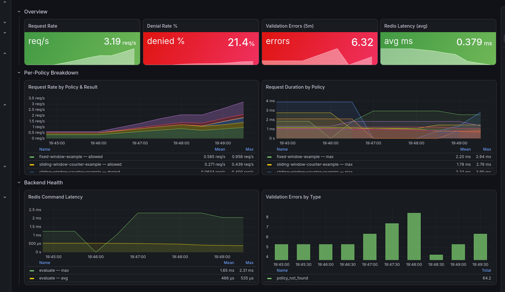

[](https://app.codacy.com/gh/SimonJPegg/sluice/dashboard?utm_source=gh&utm_medium=referral&utm_content=&utm_campaign=Badge_grade)
# Sluice

A standalone rate limiting service. You ask "can I do this?" over HTTP, it tells you yes or no with enough context to act on.

## Try it

```bash
git clone https://github.com/simonJPegg/sluice.git
docker compose up
```

Then:

```bash
curl -X POST http://localhost:8080/check \
  -H "Content-Type: application/json" \
  -d '{"key": "user-123", "policyId": "fixed-window-example"}'
```

That's it. Sluice + Redis, running locally, no cluster needed.

## API

`POST /check` with `{"key": "...", "policyId": "..."}`.

Returns:
- `200` with `X-RateLimit-Limit`, `X-RateLimit-Remaining`, `X-RateLimit-Reset` — allowed
- `429` with `Retry-After` — denied
- `404` — unknown policy
- `400` — bad input

Health: `/health/live`, `/health/ready`, `/health/status`

## Deploy

Helm chart in `charts/sluice/`. See the [chart README](charts/sluice/README.md) for values and configuration.

For local development, `docker compose up` builds from source and wires everything together with example policies.

## Tech

Kotlin 2.x, Ktor, Lettuce, Micrometer. JVM 21. Gradle.

## Design


- Sealed types enforce exhaustive handling at every decision point — validation, evaluation, and response mapping. No exceptions for control flow
- Atomic counters via Redis Lua scripts. In-memory uses `ConcurrentHashMap.compute`
- Four algorithms: fixed window, sliding window counter, sliding window log, token bucket
- Pluggable via policy config — pick the algorithm that fits, per key
- Redis-backed (Lua scripts for atomicity) or in-memory (for testing)
- Fail-open or fail-closed per policy when Redis is unavailable
- Circuit breaker to stop hammering a dead Redis
- Policies loaded from YAML at startup, validated, no runtime mutation
- Structured JSON logging, correlation ID propagation, config validation at startup

Architecture decisions documented in `docs/decisions/`.


## Metrics

Prometheus metrics on `/metrics` — outcomes, latency, errors, store health

 

## Roadmap

### v0.1.0 — (current)
-~~Backpressure / load shedding under degraded Redis~~

### v0.2.0 — Security
- Authentication on `/check`

### v1.0.0 — Confidence
- Load testing with k6 (published baselines)
- Chaos testing (Redis failure, network partitions, latency injection)

## Why

I was bored and wanted to enjoy programming again. Picked a problem where concurrency,
atomicity, and time all fight each other — and Kotlin because I'd never used it before.
