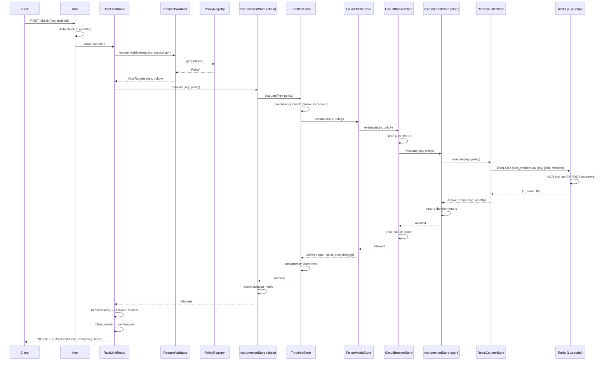

# Sequence: Happy Path

Request allowed under a fixed window policy. All components healthy.

## Denied variant

Same flow until the Lua script returns `{0, count, ttl}` — the counter exceeded the limit.
`RedisCounterStore` returns `Denied(retryAfter)` instead of `Allowed`, and the response maps to `429` with `Retry-After`.
