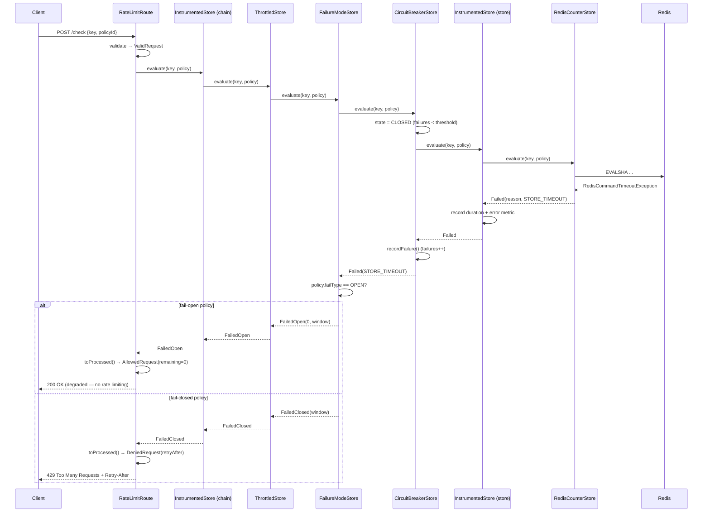
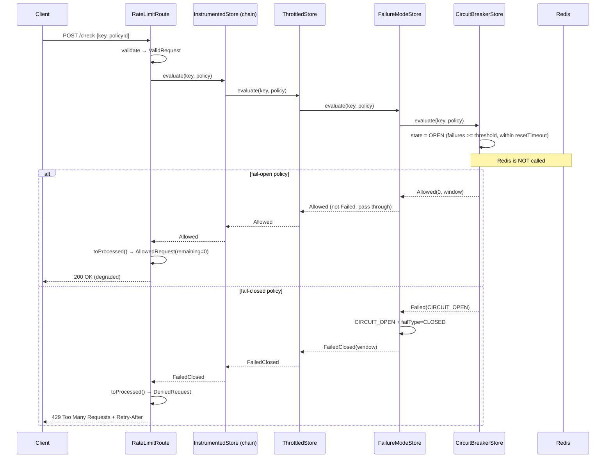
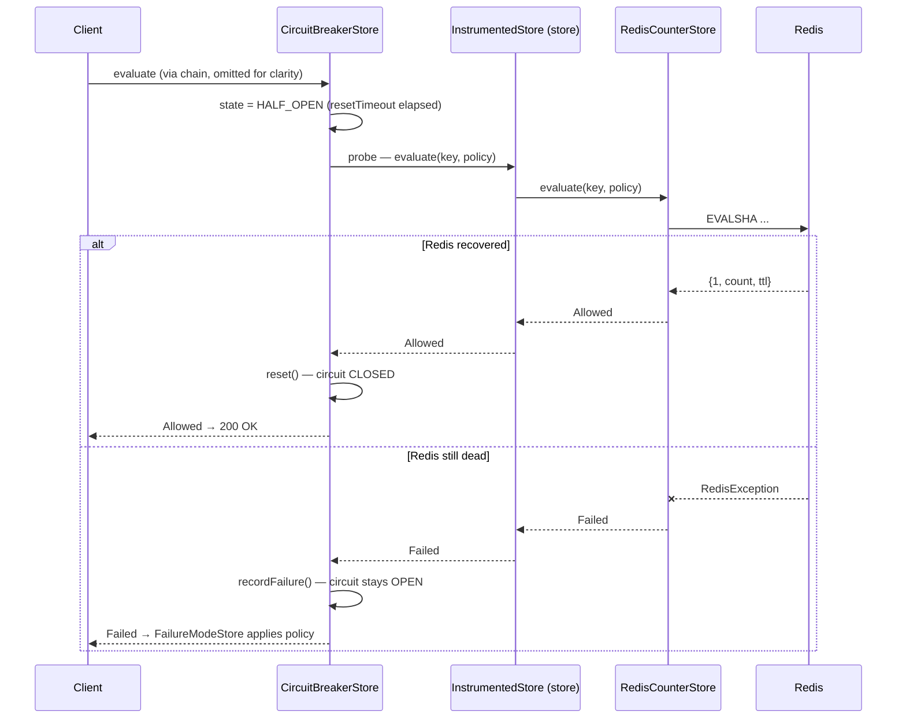

# Sequence: Redis Failure

Redis becomes unavailable. Shows the path from timeout through circuit breaker trip to policy-driven fail-open/fail-closed.

## First failure (circuit breaker still closed)

## After threshold (circuit breaker open)

Once `failures >= failureThreshold`, the circuit breaker stops calling Redis entirely.

## Recovery (half-open probe)

After `resetTimeout` elapses, the circuit breaker lets one request through to test Redis.

